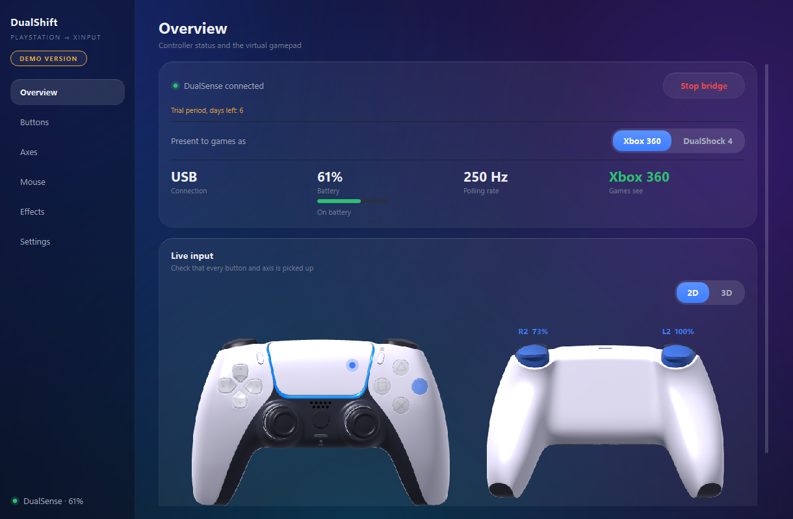
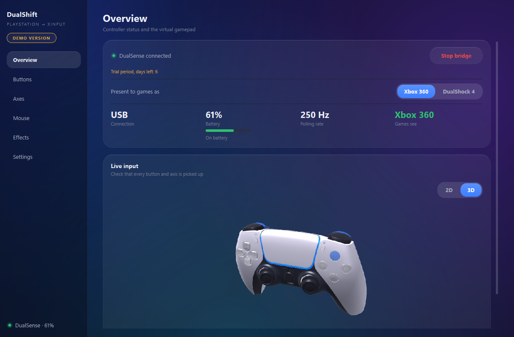
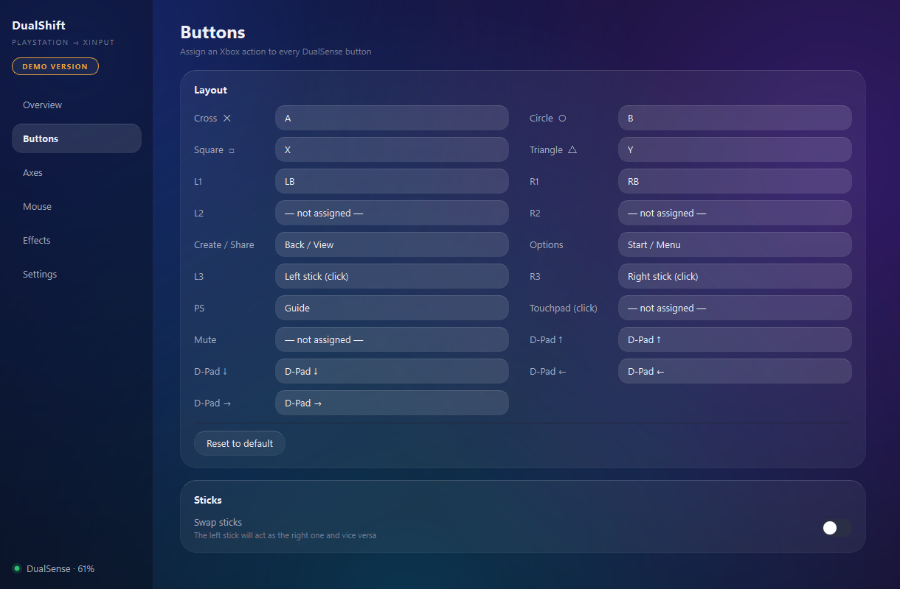
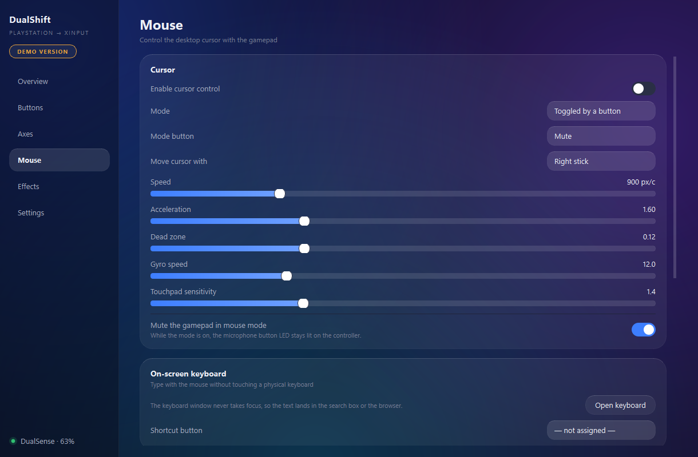
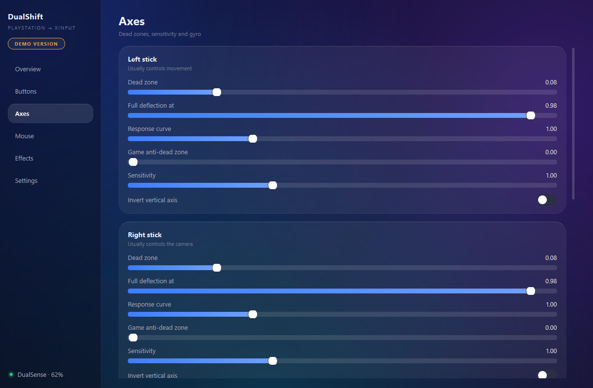
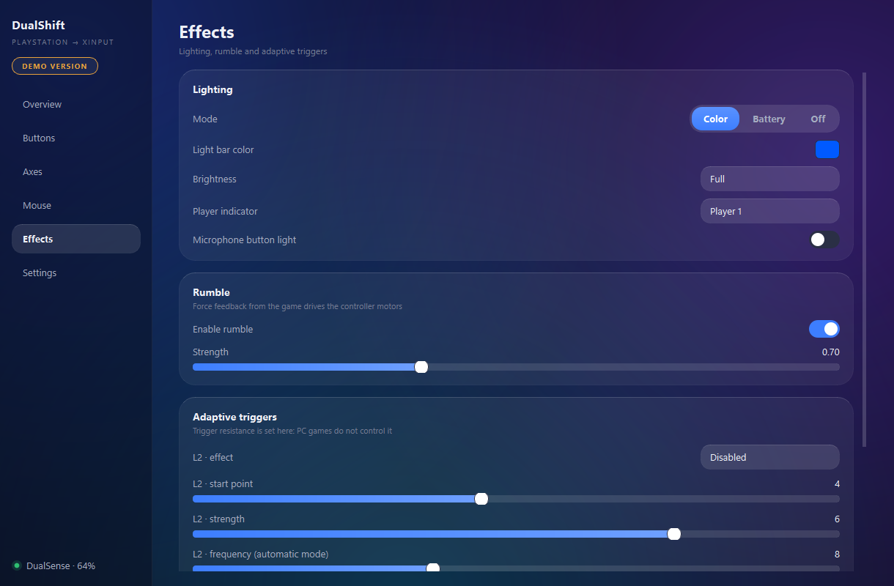

# DualShift

**PlayStation controllers, native on Windows.** Games see a plain Xbox 360
pad, so your DualSense or DualShock 4 works where it used to be ignored —
with rumble, gyro aiming, adaptive triggers and your own light bar colour.

### [⬇ Download the demo](../../releases/latest)

Free for 7 days, every feature unlocked. Windows 10 and 11, 64-bit.

[](../../releases/latest)



---

## What it does

**Makes the pad readable.** DualShift talks to the controller directly over
USB or Bluetooth and creates a virtual Xbox 360 controller in its place. A
game does not need to support PlayStation hardware — it sees the pad Windows
games have always understood. If a game does speak PlayStation, switch the
output to DualShock 4 and keep the native button icons and the touchpad.

**Rumble that arrives.** Force feedback from the game reaches the motors in
your hands the way it does on a console. The strength is adjustable.

**Gyro aiming.** The stick does the big turn, a light move of the hands does
the fine aim — the way console shooters are played, now on PC.

**Adaptive triggers.** A trigger can resist, fire in bursts, or click at the
moment of the shot. Tune it per game.

**Mouse mode.** One button turns the pad into a mouse: move the cursor with a
stick, the gyro or the touchpad, click with the shoulder buttons. Start a
film, scroll a feed, close a window — without getting up.

**On-screen keyboard.** Opens in its own window and types into whatever is
active — a browser, a search box, a chat. English, Russian and Kazakh
layouts.

**Per-game profiles.** Button mapping, stick dead zones and response curves,
light bar, rumble and trigger settings are saved per game and switch with it.

**Live controller model.** The Overview page shows your pad as a detailed
model that reacts to every press: buttons light up and sink, sticks tilt,
triggers travel as far as you pull them, the light bar glows in its real
colour and touches appear on the touchpad. Look at it flat, front and back,
or switch to 3D and turn it around with the mouse.

**14 interface languages**, light and dark theme.



| Live input and mapping | Mouse and keyboard |
|---|---|
|  |  |
|  |  |

## Requirements

- Windows 10 or 11, 64-bit
- DualSense, DualSense Edge, DualShock 4 — USB cable or Bluetooth
- ViGEmBus driver — **included in the installer**, it is offered during setup.
  Without it Windows cannot create the virtual controller.

## Installing

1. Download `DualShift Demo Setup.exe` from
   [Releases](../../releases/latest).
2. Run it. Windows will show a **SmartScreen warning** — the installer is not
   code-signed yet. Click **More info → Run anyway**. (A signing certificate
   costs real money; it is on the list.)
3. Agree to install ViGEmBus when the installer offers it. This step asks for
   administrator rights — the driver needs them, DualShift itself does not.
4. Connect the controller, open DualShift, press **Start bridge**.

To remove it: Windows Settings → Apps → DualShift → Uninstall. ViGEmBus is
left in place, other programs may be using it; it uninstalls the same way.

## Demo and full version

The demo runs **7 days with every feature unlocked** — nothing is disabled,
nothing is watermarked. After that it needs a key.

A key is issued for one computer: it is tied to the machine ID, so it keeps
working after a reinstall of the program, but not on a second PC.

**The quickest way to buy:** open **Settings → License** in the program and
press **Buy a key** (when the trial runs out, the same button also appears on
the Overview page). It opens [@DualShift_bot](https://t.me/DualShift_bot) in
Telegram with your computer code already filled in — pay with Telegram Stars
and the key arrives in the same chat, usually within seconds.

No Telegram? Write to **dauletcrazyone@gmail.com** with the computer code from
Settings, and the key comes back by mail.

## Privacy

DualShift works offline. There is no account, no telemetry and no analytics —
the trial dates and the key are stored on your own computer, and the program
sends nothing on its own. The only thing that ever leaves your PC is the
computer code, and only when you press **Buy a key** yourself: it goes into
the Telegram link so the bot knows which computer to issue the key for.

## Verifying the download

`DualShift Demo Setup.exe` 1.0.1 — 51.3 MB

```
SHA-256  4391b92b0bd4e6326041ba8eb97ce9bf736f9e6fa1d1e5c15b72c4975808a102
```

Check it in PowerShell before running:

```powershell
Get-FileHash "$HOME\Downloads\DualShift Demo Setup.exe" -Algorithm SHA256
```

## Questions, bugs, requests

Open an [Issue](../../issues). Tell me the Windows version, the controller
model and how it is connected — USB or Bluetooth — and what the Overview
page shows.

---

3D controller model: ["Playstation 5 Dualsense"](https://sketchfab.com/3d-models/playstation-5-dualsense-878c1f882808477ab81c2fe86d5a3936)
by [AHarmlessPotato](https://sketchfab.com/AHarmlessPotato), licensed under
[CC BY 4.0](https://creativecommons.org/licenses/by/4.0/). Modified: the logo
on the centre button and the lettering on the back were removed, textures
were downscaled and the parts were split so they can move with live input.

Made by Daulet Kuanysh. DualShift is not affiliated with Sony Interactive
Entertainment or Microsoft. PlayStation, DualSense, DualShock and Xbox are
trademarks of their respective owners.
