# DualShift

**PlayStation controllers, native on Windows.** Games see a plain Xbox 360
pad, so your DualSense or DualShock 4 works where it used to be ignored —
with rumble, gyro aiming, adaptive triggers and your own light bar colour.

### [⬇ Download DualShift](../../releases/latest)

**Free forever** — the bridge, button mapping, gyro, adaptive triggers and the
light bar never expire. **Pro** adds mouse mode, keyboard keys from the
controller, turbo, the on-screen keyboard and per-game profiles: free for the
first 7 days, then a one-time 500 Telegram Stars. Windows 10 and 11, 64-bit.

[](../../releases/latest)

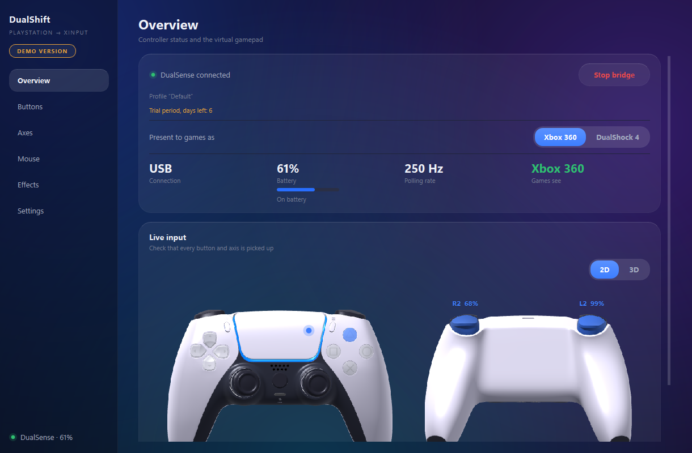

---

## What it does

**Makes the pad readable.** DualShift talks to the controller directly over
USB or Bluetooth and creates a virtual Xbox 360 controller in its place. A
game does not need to support PlayStation hardware — it sees the pad Windows
games have always understood. If a game does speak PlayStation, switch the
output to DualShock 4 and keep the native button icons and the touchpad.

**Rumble that arrives.** Force feedback from the game reaches the motors in
your hands the way it does on a console. The strength is adjustable, and
**Test rumble** checks both motors without starting a game.

**Live controller model.** The Overview page shows your pad as a detailed
model that reacts to every press: buttons light up and sink, sticks tilt,
triggers travel as far as you pull them, the light bar glows in its real
colour and touches appear on the touchpad. Look at it flat, front and back,
or switch to 3D and turn it around with the mouse.

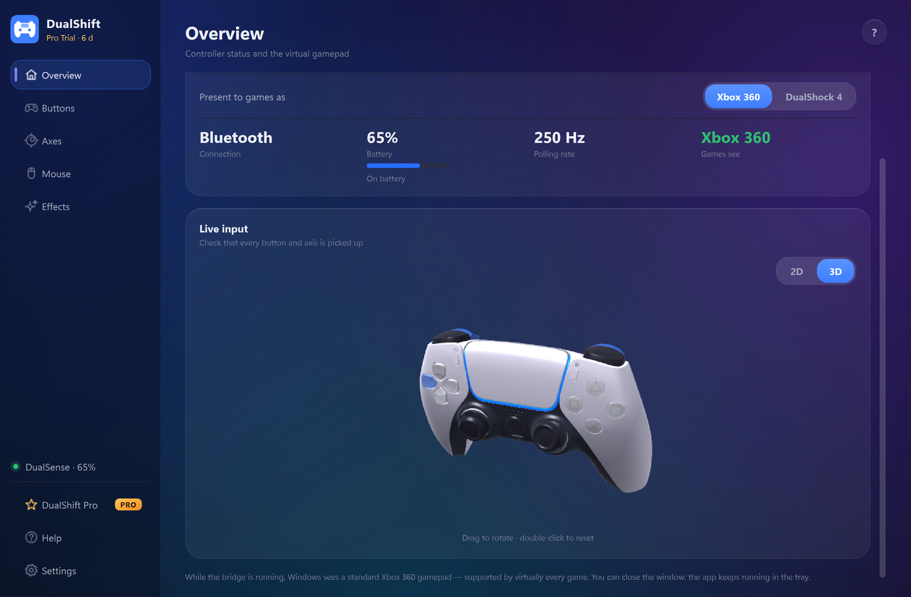

**Any button, any action.** Every button can do the job of any Xbox button —
cross, circle, square and triangle are drawn just like on the controller.

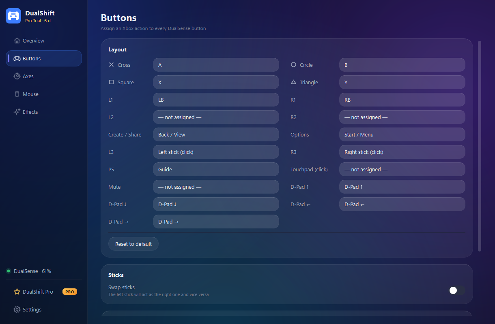

**Sticks tuned to your hands.** Dead zone, full deflection, response curve,
anti-dead zone and sensitivity for each stick and trigger.

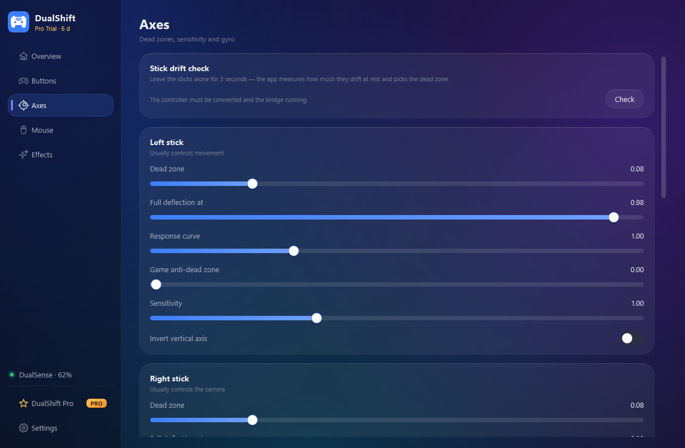

**Stick drift check.** Leave the sticks alone for three seconds: DualShift
measures how much they drift at rest and offers the right dead zones — one
click on **Apply**.

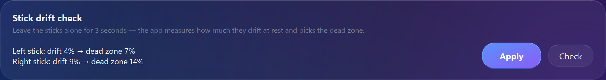

**Gyro aiming.** The stick does the big turn, a light move of the hands does
the fine aim — the way console shooters are played, now on PC. It can work
all the time or only while you hold L2, like aiming down sights. Send the gyro
into a stick, or into the **mouse** for pixel-precise aim in PC shooters: the
game gets mouse movement together with the controller, the way Steam Input and
JoyShockMapper do it. Small, careful aiming moves reach the game too:
DualShift makes up for the game's own stick dead zone, filters out sensor noise
and finds the sensor's zero by itself whenever the controller lies still — the
aim does not drift.

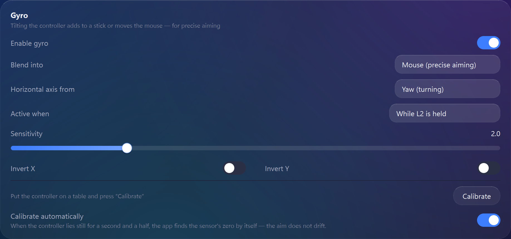

**Adaptive triggers.** Six effects built into the DualSense: resistance,
progressive resistance that builds up like a brake pedal, a semi-automatic
click at the moment of the shot, automatic fire, a bow string that snaps back
and a galloping rhythm. Set the start point, strength and speed for L2 and R2
separately, per game.

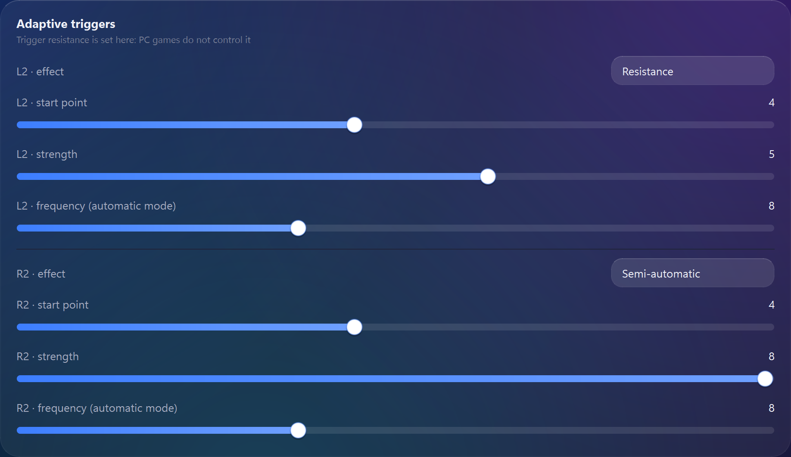

**Light bar and rumble.** A solid colour of your choice, a battery indicator,
or effects: the light bar can breathe in your colour or run through a
rainbow. Brightness, player lights and the microphone light are here too.

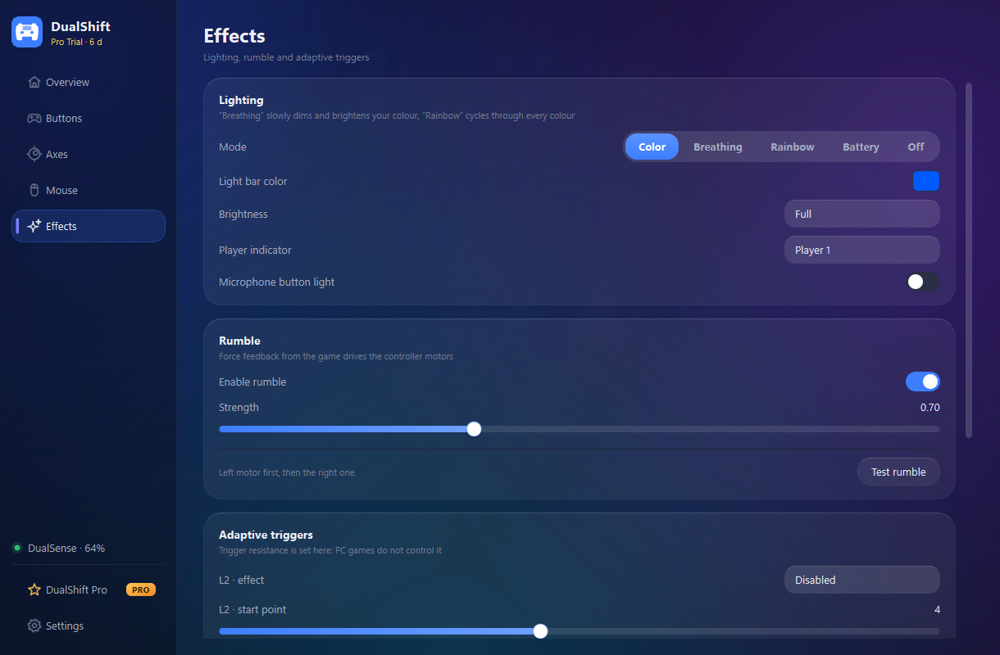

**Turbo** *(Pro)*. Hold a button and the game gets rapid repeated presses —
from 2 to 20 a second. Face buttons, shoulders, stick clicks, the D-pad, and
L2 and R2 too.

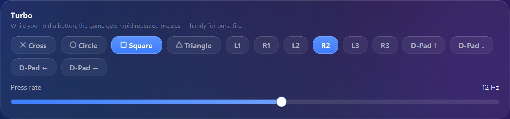

**Mouse mode** *(Pro)*. One button turns the pad into a mouse: move the cursor
with a stick, the gyro or the touchpad, click with the shoulder buttons,
scroll with the other stick. Start a film, scroll a feed, close a window —
without getting up.

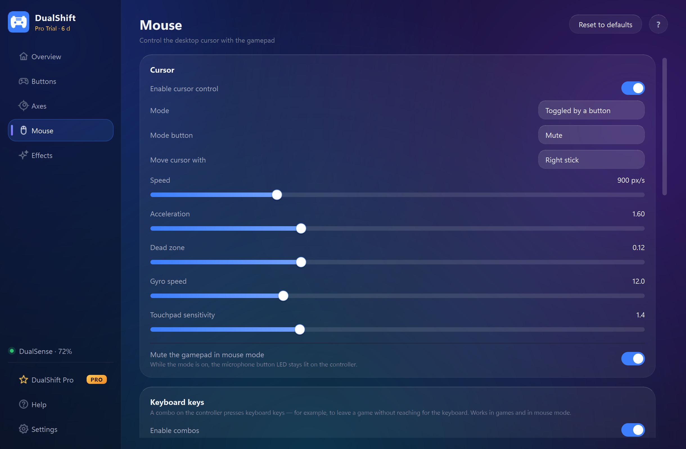

**Keyboard keys from the controller** *(Pro)*. Hold PS and press a second
button to send a key combination: **PS + Options** switches out of the game
(Alt+Tab), **PS + Create** opens Start, others press Esc, show the desktop or
change the volume. Ready-made combos also take a game screenshot, record the
last 30 seconds or start a recording through Xbox Game Bar. Pick your own
buttons and keys, or record any combination. Works in games and in mouse mode.

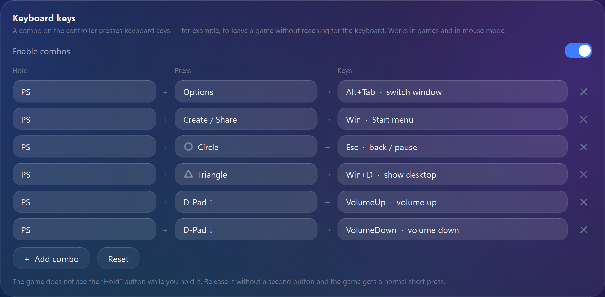

**On-screen keyboard** *(Pro)*. Opens in its own window and types into
whatever is active — a browser, a search box, a chat. English, Russian and
Kazakh layouts.

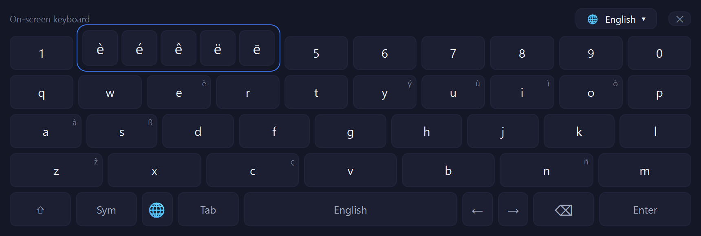

**Profiles that switch with the game** *(Pro)*. Button mapping, stick dead
zones and response curves, light bar, rumble, turbo and trigger settings are
saved per game. Add the game to its profile — pick it from the programs that
are open, or choose its .exe — and DualShift turns that profile on when the
game comes to the front, then goes back to the previous one when you leave.
Profiles can be exported to a file and imported on another PC or by a friend.
You can also switch profiles from the tray icon, without opening the window.

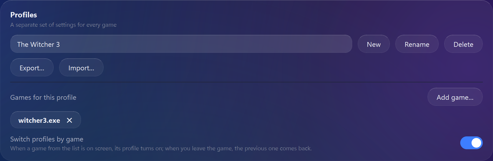

**Motion for emulators.** Turn on the DSU motion server in Settings, and
Cemu, Ryujinx, Dolphin, Citra and other emulators get the controller's gyro
for motion controls — steer, aim and shake the way the original console
games expect. It listens on this computer only (127.0.0.1, port 26760).

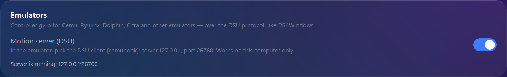

**No double input from Steam.** When Steam is running, the Overview page
reminds you how to avoid a game seeing the controller twice: turn off Steam
Input for that game, or turn on exclusive access in DualShift.

**Low battery warning.** When the controller drops to 15%, and again at 5%,
Windows shows a notification and the pad buzzes twice — so the match does not
end with a dead controller.

**Back to factory settings in one click.** Every page — Buttons, Axes, Mouse,
Effects — has its own **Reset to defaults** button for just that section, and
Settings has **Reset everything**. DualShift asks first, and your profiles,
game list, language and Pro key stay.

**14 interface languages**, a dark and a light theme, smooth animations.

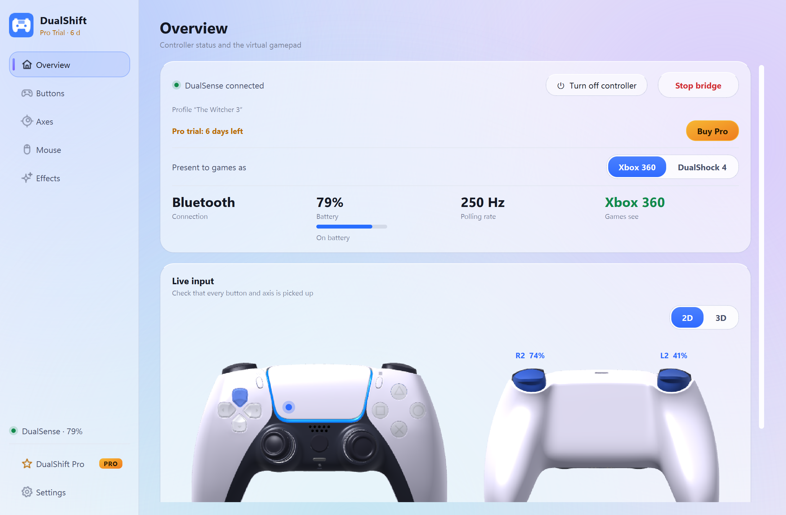

**DualShift Pro.** Everything above marked *Pro* — one payment, no
subscription. The Pro page shows your licence, the price and what each plan
includes.

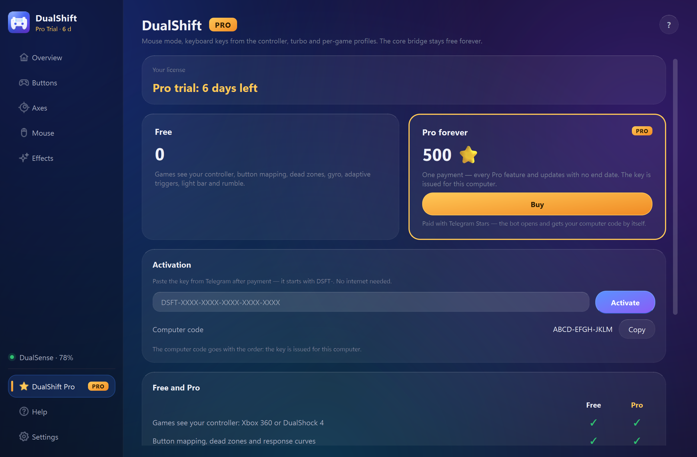

## Requirements

- Windows 10 or 11, 64-bit
- DualSense, DualSense Edge, DualShock 4 — USB cable or Bluetooth
- ViGEmBus driver — **included in the installer**, it is offered during setup.
  Without it Windows cannot create the virtual controller.

## Installing

1. Download `DualShift Setup.exe` from
   [Releases](../../releases/latest).
2. Run it. Windows will show a **SmartScreen warning** — the installer is not
   code-signed yet. Click **More info → Run anyway**. (A signing certificate
   costs real money; it is on the list.)
3. Agree to install ViGEmBus when the installer offers it. This step asks for
   administrator rights — the driver needs them, DualShift itself does not.
4. Connect the controller, open DualShift, press **Start bridge**.

Already have an older version? Install on top — your settings, profiles and
key stay where they are. If you had **DualShift Demo**, the installer replaces
it with the regular version. When a new version comes out, the Overview page
tells you and links to the download.

To remove it: Windows Settings → Apps → DualShift → Uninstall. ViGEmBus is
left in place, other programs may be using it; it uninstalls the same way.

## If a key combo does nothing in a game

Some games run **as administrator**, and Windows does not let ordinary
programs press keys inside them. DualShift notices this and offers to restart
with administrator rights; you can also turn on **Settings → Behaviour → Run
as administrator**. Games protected by anti-cheat may block synthetic key
presses altogether.

## Free and Pro

| | Free | Pro |
|---|:---:|:---:|
| Games see your controller — Xbox 360 or DualShock 4 | ✓ | ✓ |
| Button mapping, dead zones, response curves | ✓ | ✓ |
| Gyro aiming, adaptive triggers | ✓ | ✓ |
| Light bar with effects, rumble, live 3D model | ✓ | ✓ |
| Gyro as a mouse for precise aim in PC games | ✓ | ✓ |
| Motion server for emulators (DSU) | ✓ | ✓ |
| Stick drift check | ✓ | ✓ |
| Mouse mode: cursor from a stick, the gyro or the touchpad | — | ✓ |
| Keyboard keys from the controller: Alt+Tab, Esc, volume | — | ✓ |
| On-screen keyboard | — | ✓ |
| Turbo | — | ✓ |
| Per-game profiles that switch automatically | — | ✓ |

For the first **7 days** after installing, Pro is on in full. After that
DualShift keeps working as Free — nothing stops, the Pro cards simply lock
until you enter a key. **Pro is a one-time 500 Telegram Stars**, with updates
and no end date.

A key is issued for one computer: it is tied to the machine ID, so it keeps
working after a reinstall of the program, but not on a second PC.

**How to buy:** open the **DualShift Pro** page in the program and press
**Buy**. It opens [@DualShift_bot](https://t.me/DualShift_bot) in Telegram
with your computer code already filled in — pay with Telegram Stars and the
key arrives in the same chat, usually within seconds. Paste it on the same
page and press **Activate**.

No Telegram? Write to **dauletcrazyone@gmail.com** with the computer code from
the DualShift Pro page, and the key comes back by mail.

## Privacy

There is no account, no telemetry and no analytics — the trial dates, the key
and your profiles are stored on your own computer.

DualShift makes one request on its own: at startup it asks GitHub for the
number of the latest release, to tell you when an update is out. Nothing about
you, your PC or your controller goes with it, and you can turn it off in
**Settings → About → Check for updates automatically**.

The computer code leaves your PC only when you press **Buy a key** yourself:
it goes into the Telegram link so the bot knows which computer to issue the
key for.

## Verifying the download

`DualShift Setup.exe` 1.0.7 — 51.1 MB

```
SHA-256  47782d4d57a1cf1bf027e2c2381000c4a6ac6a464dc6824fb493ab1b9fb02e6e
```

Check it in PowerShell before running:

```powershell
Get-FileHash "$HOME\Downloads\DualShift Setup.exe" -Algorithm SHA256
```

## Questions, bugs, requests

Open an [Issue](../../issues). Tell me the Windows version, the controller
model and how it is connected — USB or Bluetooth — and what the Overview
page shows.

---

3D controller model: ["Playstation 5 Dualsense"](https://sketchfab.com/3d-models/playstation-5-dualsense-878c1f882808477ab81c2fe86d5a3936)
by [AHarmlessPotato](https://sketchfab.com/AHarmlessPotato), licensed under
[CC BY 4.0](https://creativecommons.org/licenses/by/4.0/). Modified: the logo
on the centre button and the lettering on the back were removed, textures
were downscaled and the parts were split so they can move with live input.

Adaptive trigger effects are encoded after
[TriggerEffectGenerator](https://gist.github.com/Nielk1/6d54cc2c00d2201ccb8c2720ad7538db)
by John "Nielk1" Klein, MIT License.

Made by Daulet Kuanysh. DualShift is not affiliated with Sony Interactive
Entertainment or Microsoft. PlayStation, DualSense, DualShock and Xbox are
trademarks of their respective owners.
